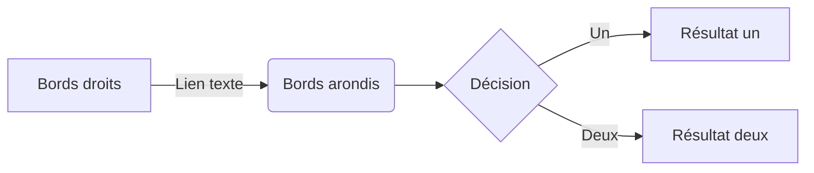
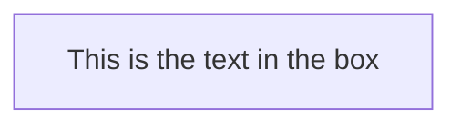
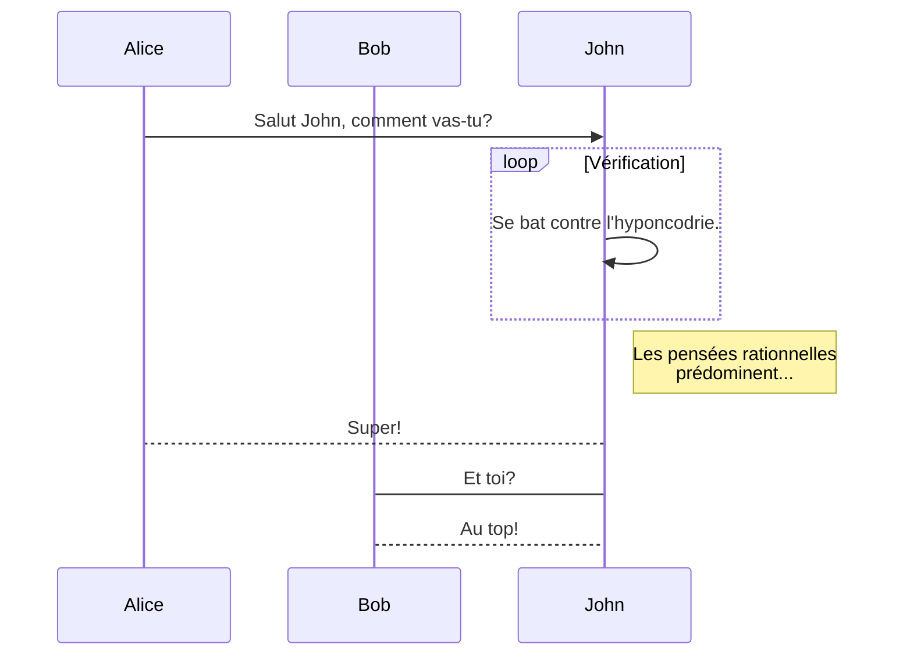
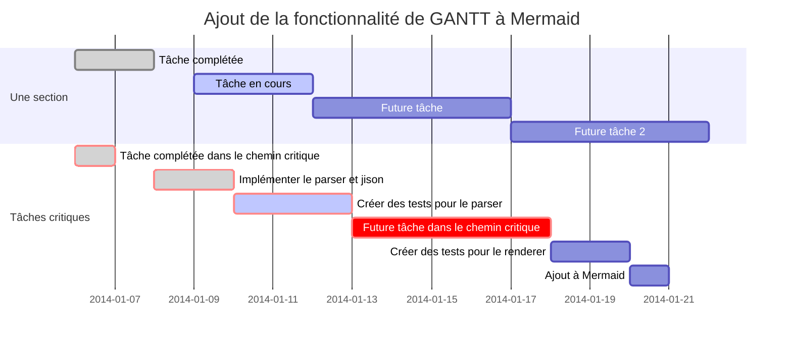
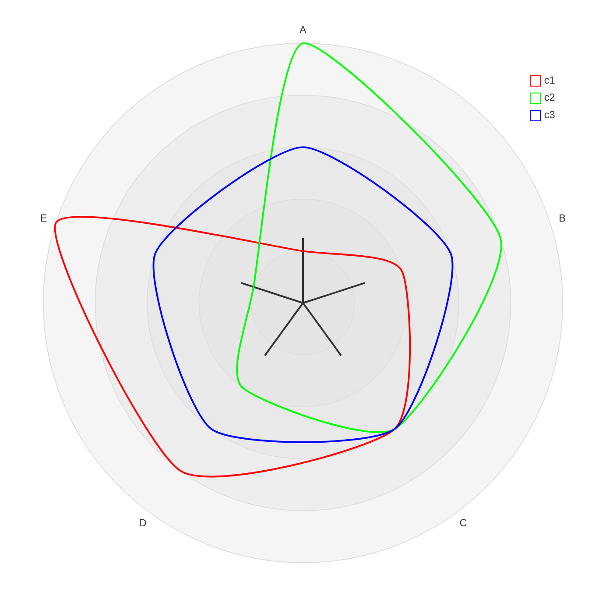
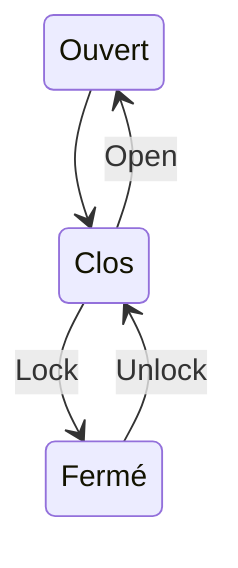
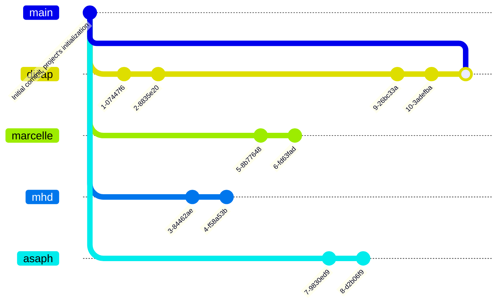

# Exemple de diagramme Mermaid
:metal:

|Variable|Valeur|Description|
|:---|:---:|---:|
|A|1|Entier|
|B|2||

---
title: Node with text
---

---
config:
  flowchart:
    htmlLabels: false
---

---




---
```
[params]
  # Ordre du contenu du menu latéral du site (https://gohugo.io/templates/lists/#order-content)
  siteContentOrder = "weight"
  siteContentOrder = "date"
  siteContentOrder = "publishdate"
  siteContentOrder = "expirationdate"
  siteContentOrder = "lastmodifieddate"
  siteContentOrder = "length"
  siteContentOrder = "title"
  siteContentOrder = "linktitle"
```
---

---


---



---


---
```mermaid
gitGraph:
  commit
  branch newbranch
  checkout newbranch
  commit
  commit
  checkout master
  commit
  commit
  merge newbranch
```
---


---

