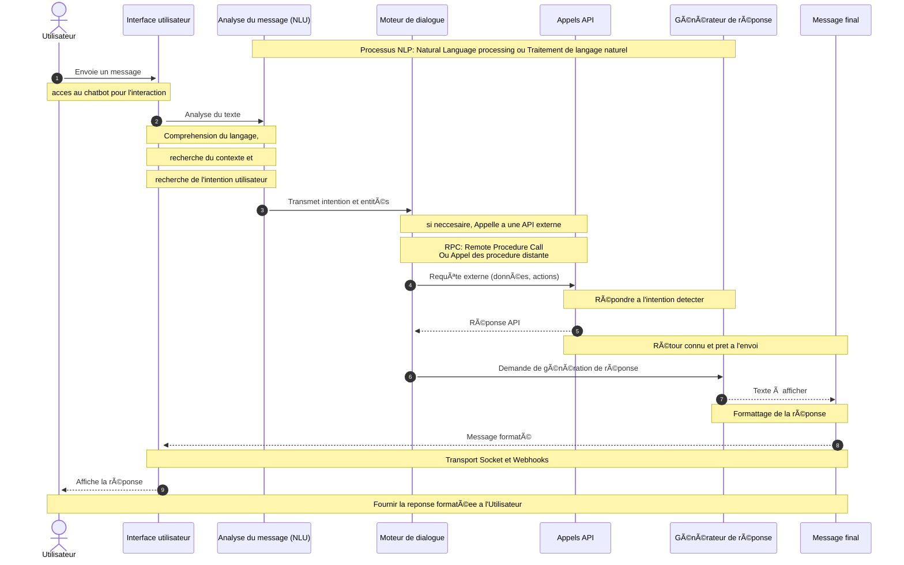
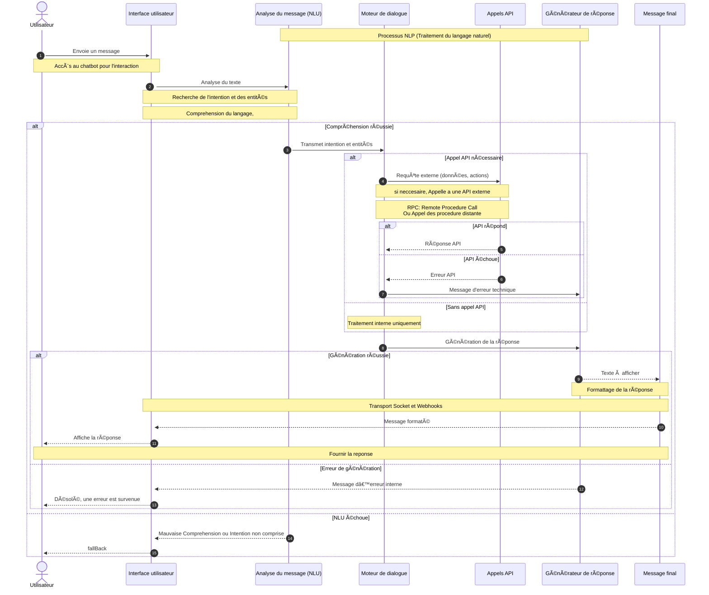
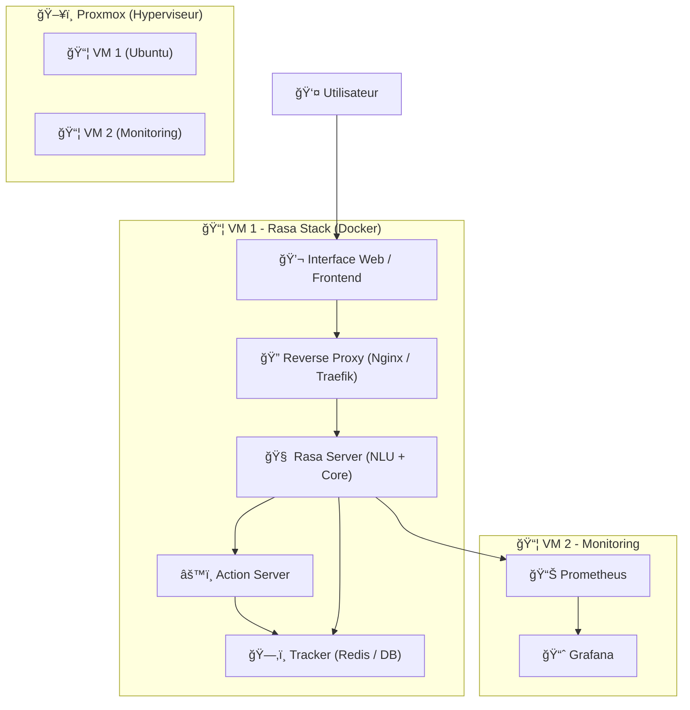

```mermaid
graph TD
    user_start[Utilisateur] --> ui[Interface utilisateur\n(Web, mobile, voix)]
    ui --> nlu[Analyse du message\n(NLU)]
    nlu --> dialogue[Moteur de dialogue\n(Contextes, intents)]
    dialogue --> response[Générateur de réponse\n(IA ou texte fixe)]
    dialogue --> api[Appels API\n(données, actions)]
    response --> output[Message final]
    output --> user_end[Utilisateur]
```


flowchart TD
    Start --> Stop









ChatGPT said:
Excellente question ğŸ‘
Pour un rapport sur un agent conversationnel ou chatbot, tu dois choisir les diagrammes en fonction de ce que tu veux expliquer : fonctionnement, architecture, comportement, interactions...

✅ Voici les diagrammes les plus pertinents à inclure :
Diagramme	Objectif	Recommandé ?
Diagramme de cas d'utilisation (Use Case)	Montrer qui fait quoi avec le système (acteurs + fonctionnalités)	✅ Oui, au début (spécifications fonctionnelles)
Diagramme de séquence	Montrer le flux d'interaction entre composants au fil du temps	✅ Oui, pour illustrer une requête utilisateur typique
Diagramme de classes (optionnel)	Montrer la structure des données ou objets manipulés	✅ Si tu as une implémentation orientée objet
Diagramme d'activité / de flux	Montrer un enchaînement logique d'étapes	✅ Oui, pour le flux de traitement d’un message
Diagramme de composants (architecture)	Montrer les blocs techniques (NLU, API, UI, etc.) et leur interaction	✅ Oui, pour décrire l'architecture globale
Diagramme d’état (State machine)	Montrer les états du chatbot (attente, question, réponse, erreur…)	âœ”ï¸ Facultatif, utile si le chatbot a une logique d'état forte
Diagramme de déploiement	Montrer comment le système est installé sur des machines/serveurs	âœ”ï¸ Optionnel, à inclure si tu parles de déploiement
Diagramme d'interaction NLU/NLP (non UML)	Montrer les étapes NLP : compréhension, API, réponse…	✅ Oui, souvent avec flowchart ou sequenceDiagram Mermaid

🧩 Ordre conseillé dans ton rapport :
Cas d'utilisation → pour définir le périmètre fonctionnel

Architecture fonctionnelle (flowchart ou composant) → pour expliquer comment le chatbot est construit

Diagramme de séquence → pour montrer le cycle complet d’un message

Diagramme de traitement NLP → pour détailler la logique interne

(État, activité, ou déploiement si nécessaire)

ğŸ Bonus :
Tu peux aussi intégrer :

un tableau comparatif des solutions (comme Botpress, Rasa, GPT…)

des captures d’écran si tu as un prototype ou interface

Souhaites-tu que je t’aide à créer un plan structuré avec les bons diagrammes aux bons endroits dans ton rapport ?


You said:
oui

ChatGPT said:
Parfait ! Voici un plan structuré de rapport pour un projet d’agent conversationnel (chatbot), avec les diagrammes à insérer à chaque chapitre, et des suggestions sur quoi mettre et où.

🧾 Plan de rapport conseillé avec diagrammes
📘 Chapitre 1 : Introduction
Présentation du contexte et du besoin

Objectifs du projet

Méthodologie suivie

Technologies choisies (ex : Rasa, GPT, Botpress…)

✅ Aucun diagramme ici (sauf schéma contextuel global si nécessaire)

📘 Chapitre 2 : Présentation des concepts
Définition d’un agent conversationnel

Différence entre NLP, NLU, etc.

Types d'agents : à règles, à IA, hybrides

Composants d’un chatbot

✅ Diagramme de composants fonctionnels
(expliquant : Interface utilisateur → NLU → Dialogue → API → Générateur de réponse)

📘 Chapitre 3 : Étude des besoins fonctionnels
Description des utilisateurs (acteur principal : utilisateur final, admin, etc.)

Fonctionnalités attendues

✅ Diagramme de cas d'utilisation UML

Acteurs : Utilisateur, Administrateur

Cas : Poser une question, Recevoir une réponse, Consulter logs, Configurer intents...

📘 Chapitre 4 : Architecture du système
Description des choix d’architecture

Présentation des composants internes et externes (API, moteur de dialogue, base de données…)

✅ Diagramme de composants technique
✅ Schéma d’architecture réseau ou déploiement (si tu déploies sur serveur, Docker, etc.)

📘 Chapitre 5 : Comportement du chatbot
Description du cycle de traitement d’un message

Gestion du dialogue, contexte, erreurs

✅ Diagramme de séquence

Utilisateur → Interface → NLU → Dialogue → API → Réponse
✅ Diagramme d'activité (ou flowchart)

Enchaînement : réception, compréhension, réponse, feedback
✅ Diagramme d’état (facultatif)

États du chatbot : attente, en conversation, erreur, terminé…

📘 Chapitre 6 : Mise en œuvre
Choix de la solution (Rasa, GPT, etc.)

Déploiement

Interfaces utilisées (web, app, messagerie)

✅ Capture d’écran de l’interface
✅ Tableau comparatif des solutions existantes
(Rasa vs Botpress vs Dialogflow vs GPT)

📘 Chapitre 7 : Résultats / Tests
Cas de tests

Résultats obtenus

✅ Eventuellement un diagramme de test ou de log (optionnel)

📘 Chapitre 8 : Conclusion et perspectives
Résumé des apports

Limites rencontrées

Pistes d’amélioration (reconnaissance vocale, multilingue…)

🨠Résumé des diagrammes à inclure par chapitre
Chapitre	Diagramme
2	Diagramme de composants fonctionnels
3	Cas d’utilisation (UML)
4	Composants techniques + déploiement
5	Séquence + Activité (flowchart) + État (optionnel)
6	Comparatif (tableau) + capture interface

Souhaites-tu que je t’aide à remplir les parties de ce rapport avec du contenu ou des exemples pour chaque diagramme ?


Get smarter responses, upload files and images, and more.

Log in

Sign up for free


Attach

Search